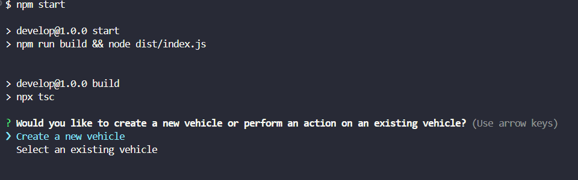

  # Title
   **<h1>GarageChecker</h1>**
   

  ## Table of Contents

  - [Description](#description)
  - [Design](#design)
  - [Install](#install)
  - [Contributor](#contributor)
  - [License](#license)
  - [Questions](#questions)

  ## Description

   This application will ask a series of questions regarding vehicles. You can select to add a new vehicle (car, truck, motorbike) or to select an existing one. Depending on your choice, you can either enter all the details of creatiing a new vehicle or choose one already there. It will then branch off with different options.

  ## Design

    To help sort out vehicles in garage. Will display all the information needed to keep your collection in order. 

    
  ## Install/Run

    npm start

    Select your options, this displays New vehicle

    Once you enter your new vehicle inforation and select Show existing you can see it with the others.

    You can keep selecting options until you are done, then select Exit.

 

    Check out this video to see how it works!

[App demo here!](https://drive.google.com/file/d/1_3Yi65Z_Uj4IIsx057Hw0jF5HoFsyvlv/view)

  ## Contributor

   mvoidets

  ## License

    This is not licensed  

  ### Questions

  If you have any questions, please contact me at: [mvoidets@yahoo.com] (mailto:mvoidets@yahoo.com). 

  My GitHub profile is [mvoidets](https://guthub.com/mvoidets).

  Thank you for visiting my repository!